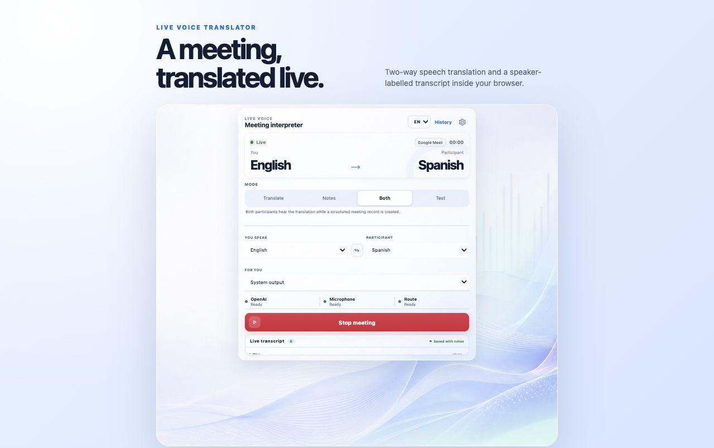
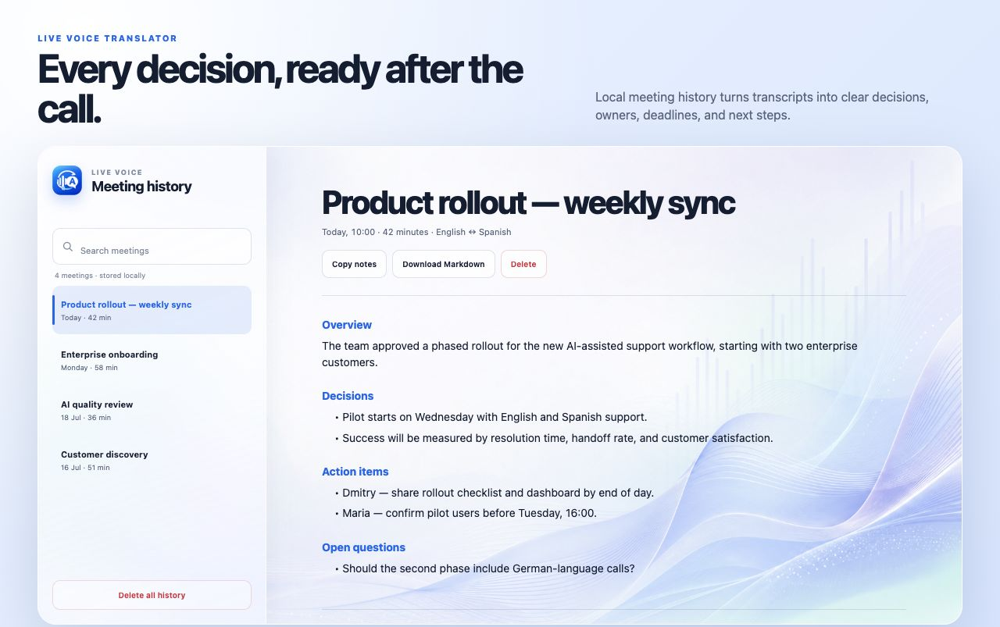
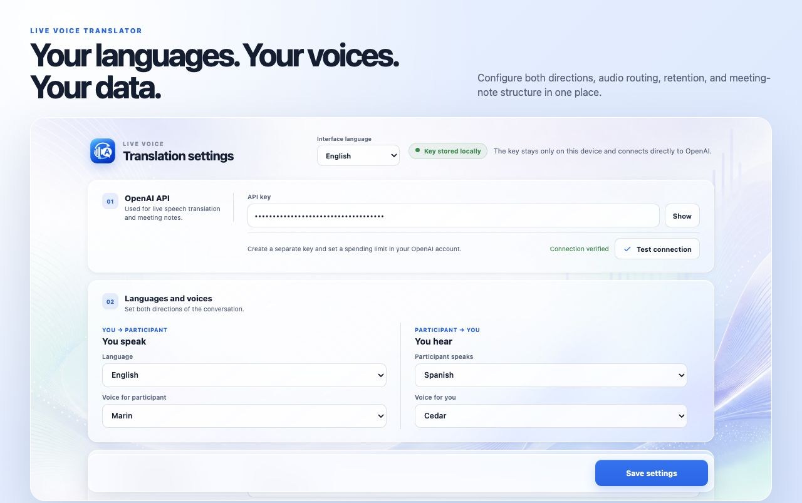

<p align="center">
  
</p>

<h1 align="center">Live Voice Translator</h1>

<p align="center">
  Speak naturally across languages in browser meetings with real-time,
  two-way AI voice translation.
</p>

<p align="center">
  <a href="https://github.com/mkdmit/live-voice-translator/stargazers"></a>
  <a href="LICENSE"></a>
  
  
</p>

## What is Live Voice Translator?

Live Voice Translator is an open-source Chrome extension that helps people
communicate across language barriers during online meetings. You speak in your
language, the other participant hears a translated voice in theirs, and their
reply is translated back for you in real time.

It is designed for multilingual conversations in Google Meet, Zoom Web, Yandex
Telemost, and Telegram Web: international sales calls, customer interviews, remote-team
meetings, product demos, support sessions, and everyday cross-language
communication. Translation runs through the user's own OpenAI API key.

The extension also supports meeting notes. Choose one of four modes before a
call: **Translation**, **Notes**, **Translation + Notes**, or **Transcript**.

> If live multilingual meetings should be easier, please consider starring the repository. It helps other people discover the project.

## Highlights

- **Two-way voice translation** during live browser meetings, delivered with the
  speaker's own loudness, pace, emphasis, and emotion rather than a flat read
- **Translated outgoing microphone** for supported WebRTC conferences
- **Live speaker-labelled transcript** in a persistent Chrome side panel
- **Per-direction controls**, usable before and during a call: switch off an
  interpreter to stop sending that side's audio to the API entirely, mute a
  translation to fall back to the untranslated voice, add the original voice to hear
  or send both at once, or mute a whole direction for real silence. Only switching an
  interpreter off pauses that side's transcript
- **Structured meeting notes** with decisions, tasks, deadlines, and open questions
- **Six interface languages**: English, Russian, Spanish, German, French, and Brazilian Portuguese
- **Local-first history** with configurable retention and Markdown export
- **No project backend or analytics** — connect directly with your own OpenAI API key
- **Open source under MIT**

## Product tour

The screenshots below use fictional demo meetings and contain no real customer
data or API credentials.

### Live two-way translation



### Meeting notes and history



### Translation settings



Clicking the extension icon opens a persistent Chrome side panel. Translation
and note capture continue when the panel is closed or the user switches tabs.
The extension badge shows `ON` while a session is active and `!` after an error.

In supported browser conferences, the extension replaces the outgoing WebRTC
microphone track with translated speech. The original microphone is restored
when the session stops. Google Meet, Zoom Web, and Yandex Telemost are the
current browser targets; native desktop conference applications are out of
scope.

## Status

Version 0.9.2 is a browser-only release candidate for Chrome. It captures the conference tab, replaces the meeting's outgoing WebRTC microphone track with translated speech, restores the original microphone on stop, tracks session duration locally, retries a dropped incoming Realtime connection, and limits long-running sessions. The side panel shows a live, speaker-labelled transcript while the meeting runs. Translation-only transcripts remain in memory and disappear when the next session starts; note, combined, and text modes save the transcript with the meeting. Meeting notes can be customized by section; final transcripts can identify remote speakers when the selected transcription model returns diarized segments.

## Requirements

- Chrome 116 or newer
- An OpenAI API account with Realtime API access
- Headphones

## Frequently asked questions

### Can I use Live Voice Translator to talk to someone who speaks another language?

Yes. The extension translates both sides of a browser-based conversation in
real time: your speech for the other participant and their speech for you.

### Which meeting platforms are supported?

The current browser targets are Google Meet, Zoom Web, and Yandex Telemost.
Native desktop meeting applications are not supported.

### Does it create transcripts and meeting notes?

Yes. It can display a live speaker-labelled transcript and create structured
meeting notes with decisions, action items, deadlines, and open questions.

### Is Live Voice Translator free and open source?

The extension is open source under the MIT License. OpenAI API usage is billed
separately to the owner of the API key.

### Is meeting history uploaded to a project server?

No. This project has no backend or analytics. Meeting history is stored locally
in the browser, while speech processing is sent directly to OpenAI using the
user's configured API key.

## macOS installer

Create a distributable DMG on a Mac:

```bash
bash scripts/build-macos-installer.sh
```

The result appears in `dist/macos/`. The installer copies a self-contained extension folder into `~/Library/Application Support/Live Voice Translator/extension`, opens Chrome and Finder, then explains the one required Chrome confirmation.

Chrome does not allow a local DMG or CRX to silently install an extension on macOS or Windows. For a one-click public installation and automatic updates, publish the extension in the Chrome Web Store; until then, use the installer below or the source steps.

## Install from source

1. Open `chrome://extensions`.
2. Enable **Developer mode**.
3. Click **Load unpacked** and select this repository directory.
4. Open the extension settings and enter your own OpenAI API key.
5. Open a supported browser conference, click the extension icon, then click
   **Start translation**.

When a notes mode is selected, stopping the session opens the meeting history.
The extension can create a Russian Markdown summary with decisions, tasks,
deadlines, and open questions. History is kept locally and can be searched,
copied, downloaded, or deleted.

Use headphones. Without them the conference audio can feed back into the
microphone and be translated repeatedly.

## Security

The key is stored in `chrome.storage.local`; it is not committed, synced, or
sent anywhere except directly to OpenAI. For a public extension, a local
companion or a small token-minting service is recommended so long-lived API
keys are never available to extension code. Create a dedicated key and set a
project spending limit.

## Known limitations

- Outgoing WebRTC microphone replacement works only in the supported browser
  versions of Meet, Zoom, and Telemost; it does not control native desktop apps.
- This build sends a user-provided long-lived API key directly to the Realtime endpoint. Do not use an unrestricted production key. See [SECURITY.md](SECURITY.md).
- Browser permission prompts and audio device labels vary by operating system.
- Meet is the first target. Telemost and browser Zoom need live compatibility
  verification.
- OpenAI API usage is billed to the key owner; the extension itself is free.
- Identifying individual remote participants depends on the transcription model
  returning diarized segments and is only performed after a notes session ends.

Read [PRIVACY.md](PRIVACY.md) and complete [RELEASE_CHECKLIST.md](RELEASE_CHECKLIST.md) before publishing a packaged build.

## License

MIT
